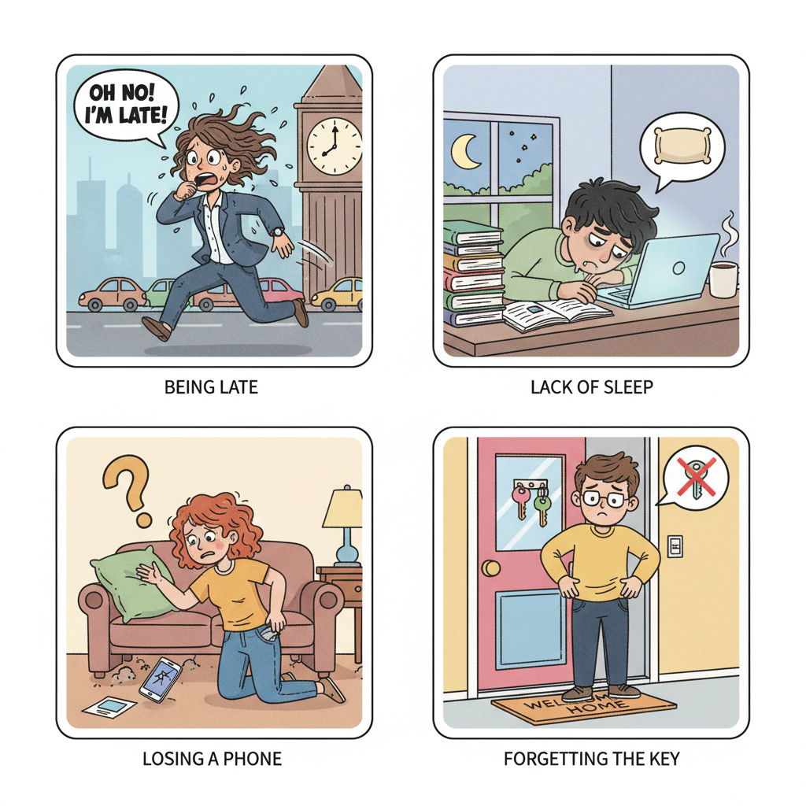
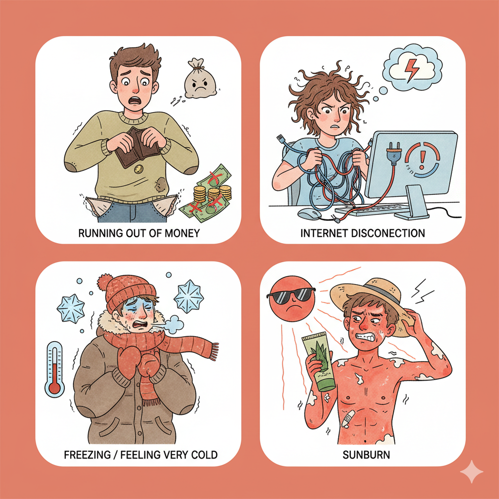
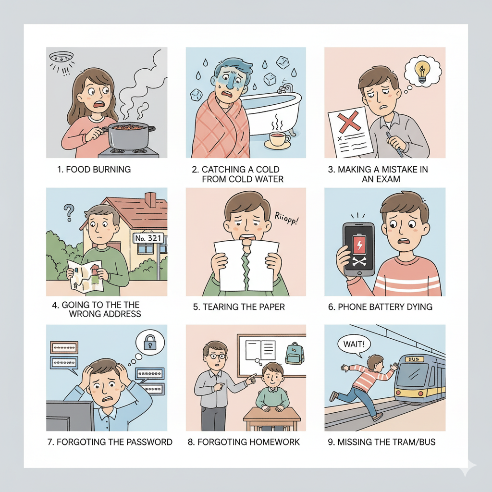
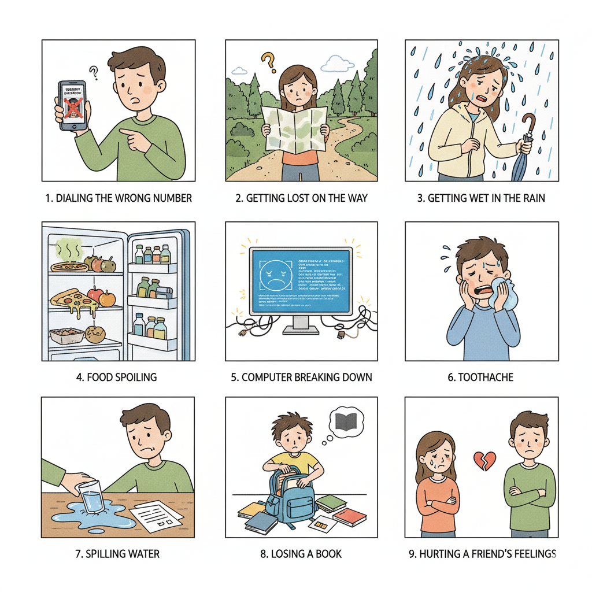
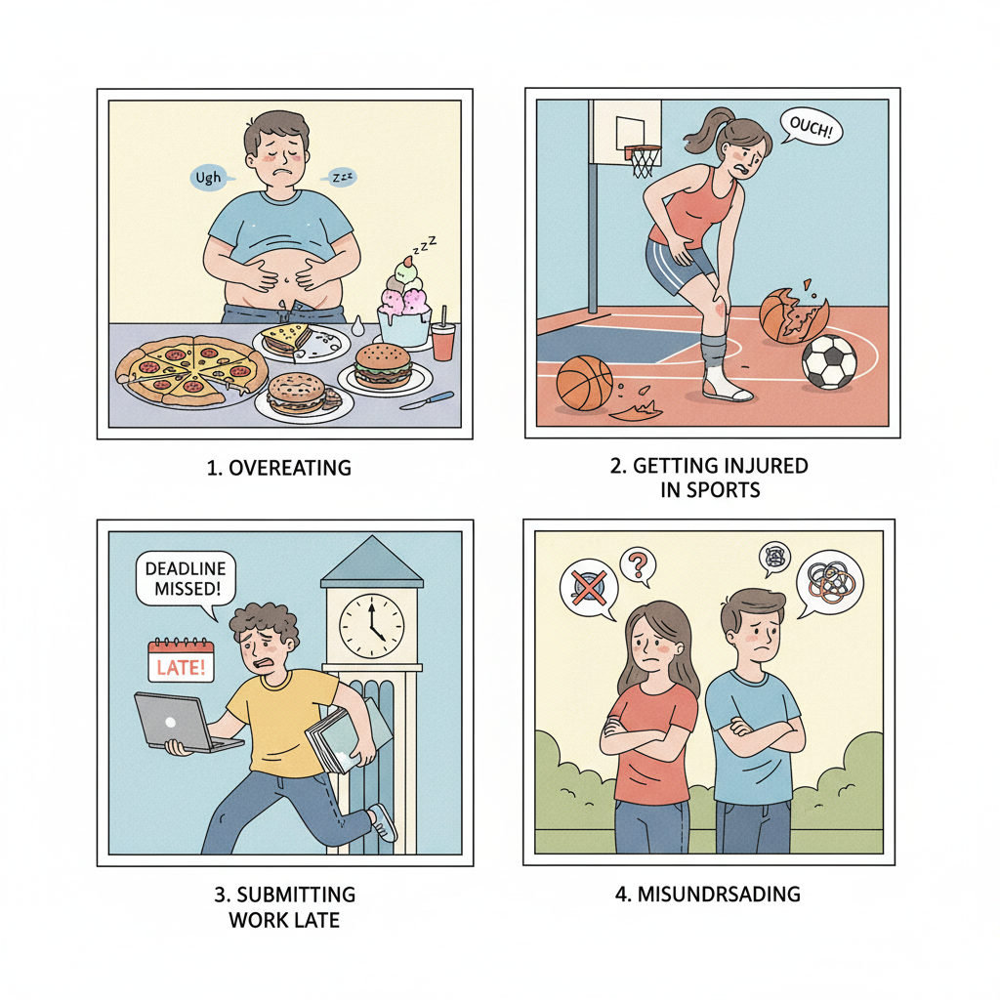

## Dars varaqasi: "-masligi uchun" (avert/avoid doing)

## 1-qism: Yengil kirish va bosqichma-bosqich mashqlar (Step by Step)

### Qadam 1. Ma’no
- "-masligi uchun" — biror salbiy holat sodir bo‘lmasligi uchun qilinadigan harakatni bildiradi: maqsad + oldini olish.
- Inglizcha: "to avoid doing" yoki "so that [X] doesn’t happen".

### Qadam 2. Shakl
- Qurilish: [Salbiy masdar] + "uchun" + [asosiy harakat]
- Andoza: [Fe’l negizi] + -ma + -sligi + uchun, ...
  - Kechik-ma-sligi uchun ertaroq chiq-di.
  - Unut-ma-sligi uchun kalitni sumkasiga sol-di.

### Qadam 3. Namunalar
- Men pul tugab qolmasligim uchun xarajatlarimni hisoblab chiqdim.
- Sen charchab qolmasliging uchun mashqni vaqtida to‘xtatding.
- Biz hujjatlar aralashib ketmasligi uchun ularni papkaga joylashtirdik.
- Siz ko‘zlaringiz charchab qolmasligi uchun kompyuter ekranidan tanaffus qildingiz.

### Qadam 4. Minimal nazorat (qisqa o‘zgartirish)
- Quyidagi juftliklarni "-masligi uchun" bilan bitta gapga birlashtiring.
  1) U ko‘p ishladi. U muddatni o‘tkazib yubormoqchi emas edi.
  2) U navigatsiyani tekshirdi. U yo‘lda adashmoqchi emas edi.
  3) U quyoshdan saqlovchi surtma surtadi. U quyoshda kuyishni istamaydi.
  4) U suvni ehtiyotkorlik bilan ichdi. U shamollamoqchi emas edi.

### Qadam 5. Mini-muammolar: mustaqil gap qurish (hech qanday qo‘shimcha ishora yo‘q)
- Vazifa: Har bir muammo bo‘yicha "-masligi uchun" ishlatib bitta maslahat yoki chorani ifodalovchi gap tuzing. (Andoza yoki javob berilmaydi — mustaqil tuzing.)

1. Kechikish
2. Uyqusizlik
3. Telefonni yo‘qotish
4. Kalitni unutish

---

1. Pul tugashi
2. Internet uzilishi
3. Sovuq qotish
4. Quyoshda kuyish

---

1. Ovqat yonib ketishi
2. Sovuq suvda shamollash
3. Imtihonda xato qilish
4. Noto‘g‘ri manzilga borish
5. Qog‘ozni yirtib yuborish
6. Telefon batareyasi tugashi
7. Parolni unutish
8. Uy vazifasini unutish
9. Tramvayni/avtobusni o‘tkazib yuborish

---

1. Noto‘g‘ri raqam terish
2. Yo‘lda adashish
3. Yomg‘irda ho‘l bo‘lish
4. Oziq-ovqat buzilishi
5. Kompyuter ishdan chiqishi
6. Tish og‘rig‘i
7. Suv to‘kilishi
8. Kitobni yo‘qotish
9. Do‘stni ranjitish

---

1. Ortiqcha ovqatlanish
2. Sportda jarohatlanish
3. Ishni kech topshirish
4. Noto‘g‘ri tushunish

---

### Qadam 6. Erkinroq nutq
- 3 ta ertalabki odatni tasvirlab bering: har birida "-masligi uchun" ishlating.
- Juftlikda rolli o‘yin: biri muammo aytadi, ikkinchisi "-masligi uchun" bilan bitta yechim gapini aytadi.

---

## 2-qism: Uchta matn — "Hammasi noto‘g‘ri ketgan kuni" (o‘qish va yozish)

### Matn A. Sitora (ish va hayot muvozanati)
Sitora:
Har kuni ish bir xil: jadvaldan jadvalga raqam ko‘chirish. To‘rt yildan beri oylik o‘zgarmaydi, ijaram esa oshib boradi. Rahbarim hamma narsani tekshiradi — xatlarimni o‘qiydi, so‘zlarimni tuzatadi, shriftni ham tanlaydi. Ba’zan katta loyihalarni bir necha kunda tugatishimizni talab qilishadi, biz tungacha qolamiz. O‘tgan haftada qizimning sahnasini o‘tkazib yubordim, erta chiqishga ruxsat berishmadi. Ofisda qisqartirish haqida mish-mishlar yuradi. Hayotimni juda o‘zgartirgim keladi!

- Tushunish savollari:
  - Sitoraning zo‘riqishini kuchaytirayotgan uch-to‘rtta omilni sanang.
  - Qaysi epizodlar ish–hayot muvozanati buzilganini ko‘rsatadi?
  - Qaysi noaniqliklar uni xavotirga solmoqda va nega?
- Yozma vazifa:
  - Sitoraga oid 5 ta profilaktik gap yozing: "… -masligi uchun …" (mas: kuyib ketmasligi uchun …; oilaviy tadbirlarni o‘tkazib yubormasligi uchun …; kechgacha qolish odatga aylanmasligi uchun …; adolatsizlik hissi kuchaymasligi uchun …; mish-mishlar vahimaga aylanmasligi uchun …).
  - 4–5 bandli shaxsiy reja tuzing: ish–hayot muvozanati saqlanishi uchun nimalar qilinishi kerak? (har bandda "-masligi uchun").

### Matn B. Shaxsiy hayot: Mark va Anna
Mark va Anna tez-tez bir-birini ayblashardi. Anna elektr to‘lovini unutganda, u: “Sen eslatmading!” dedi. Ishdan keyin Anna ovqat tayyorlardi, lekin Mark rahmat aytmasdi. Nonushtada u Annani kechikkanlik va uy ishlarini eplolmaslikda tanqid qilardi. Pul haqida janjallashib, bir hafta gaplashmay yurishdi. Anna uchrashuvlar rejalashtirar, suhbat boshlashga urinardi, lekin Mark ko‘pincha: “Charchadim, keyinroq,” derdi. Anna o‘zi yolg‘iz urinayotganini sezardi. Endi savol tug‘iladi: ular qanday qilib munosabatini yaxshilab, totuv yashashlari mumkin?

- Tushunish savollari:
  - Mark va Anna o‘rtasida takrorlanadigan uchta salbiy odatni sanang.
  - Qaysi holatlar muloqotni uzib qo‘ydi yoki sovutdi?
  - Matndan dalil keltirib, kim ko‘proq tashabbus ko‘rsatdi? Nega shunday deb o‘ylaysiz?
- Yozma vazifa:
  - Matndagi kamida 4 vaziyat uchun maslahat yozing: "… -masligi uchun …" (masalan: "Tushunmovchilik kuchaymasligi uchun …").
  - Ijobiy reja tuzing: 4–5 banddan iborat "totuv yashash uchun" qoidalar (har bandda bir marta "-masligi uchun").

### Matn C. Uydagi yakshanba: ko‘ngildagi gaplar aytilmaganida
Yakshanba kuni uyda hamma bor edi. Ona ertalabdan ovqat qildi, idish yuvdi, kirlarni joyiga qo‘ydi. Ota mehmonxonada sukutda telefoniga termuldi; u ham charchaganini biladi, lekin "rahmat" demasligi uchun o‘zini oqlayotgandek. O‘g‘il Aziz daftarini yashirdi: imtihondagi xatosi ustidan yana tanqid eshitmasligi uchun. Kechqurun elektr to‘lovi haqida gap ochilganda, hamma birdaniga jim bo‘ldi: pul bor-u, lekin mas’uliyatni bo‘lishish odatga aylangani yo‘q. Ona: "Hammasini o‘zim qilaveraman", dedi, lekin ko‘zlarida zo‘riqish bor edi. Aziz: "Men yordam beraman", demoqchi bo‘ldi-yu, noto‘g‘ri gapirib qo‘ymaslik uchun indamadi. Ota esa bolaligida minnatdorchilik aytishni o‘rgatilmagani haqida o‘yladi, ammo uyatga qolmaslik uchun bu haqda ham gapirmadi. Tun yarimlaganda, ularning uyi oppoq jimlikka to‘ldi. Ular bir-birini yaxshi ko‘rishardi — faqat aytilmagan gaplar ularni uzoqlashtirardi.

- Tushunish savollari:
  - Qaysi uchta ehtiyoj ifoda qilinmadi? (mas: qadrlanish, eshitilish, adolatli bo‘linish)
  - Qaysi iboralar yoki jimliklar vaziyatni sovutdi?
  - Har bir a’zo kichik qaysi qadamni qo‘yishi mumkin edi?
- Yozma vazifa:
  - Oilada totuvlik kuchayishi uchun 5 ta gap yozing: "… -masligi uchun …" (mas: tushunmovchilik kuchaymasligi uchun …; ranjish ortmasligi uchun …).
  - "Chegaralar va majburiyatlar" bo‘yicha 4 banddan iborat uy qoidalarini yozing; har bandda "-masligi uchun" bo‘lsin.

---

## Qisqa xulosa
- "-masligi uchun" — salbiy holatni oldini olish maqsadini bildiradi.
- Qurilish: [fe’l]-ma-sligi + uchun + [asosiy harakat].
- Har kuni uchraydigan muammolar uchun profilaktik gaplar tuzish orqali nutqni mustahkamlaymiz.

## Uyga vazifa
- Kundalik hayotingizdagi 5 ta muammo haqida yozing va har biri uchun bitta maslahatni "-masligi uchun" bilan yozing.
- O‘zingiz tanlagan mavzuda 6–8 gapdan iborat kichik matn yozing va unda kamida 3 marta "-masligi uchun" ishlating.

---

### All-new vocabulary (Yangi so‘zlar)

| Uzbek | English |
|---|---|
| -masligi uchun | in order to avoid (doing) |
| ertaroq | earlier |
| kechikmoq / kechikish | to be late / being late |
| uyqusizlik | insomnia, lack of sleep |
| yo‘qotmoq / yo‘qotish | to lose / losing |
| kalit | key |
| unutmoq / unutish | to forget / forgetting |
| pul tugashi | running out of money |
| internet uzilishi | internet disconnection |
| sovuq qotmoq | to freeze, feel very cold |
| quyoshda kuyish | sunburn |
| ovqat yonib ketishi | food burning |
| shamollamoq | to catch a cold |
| imtihon | exam |
| xato qilish | to make a mistake |
| manzil | address |
| noto‘g‘ri manzil | wrong address |
| yirtmoq / yirtilish | to tear / tearing |
| batareya (telefon) | battery (phone) |
| parol | password |
| yo‘lda adashmoq | to get lost on the way |
| yomg‘irda ho‘l bo‘lish | to get wet in the rain |
| oziq-ovqat buzilishi | food spoiling |
| kompyuter ishdan chiqishi | computer breaking down |
| tish og‘rig‘i | toothache |
| to‘kilmoq / to‘kilish | to spill / spilling |
| ranjitmoq | to hurt (feelings) |
| ortiqcha ovqatlanish | overeating |
| jarohatlanish | getting injured |
| ishni kech topshirish | submitting work late |
| noto‘g‘ri tushunish | misunderstanding |
| uzilish | interruption, outage |
| tushunmovchilik | misunderstanding |
| ehtiyot chorasi | precaution |
| oldini olish | prevention, to prevent |
| ogohlantirmoq | to warn |
| zaryad / quvvat | charge (battery) |
| o‘chib qolmoq | to turn off (suddenly) |
| shoshilmoq | to hurry |
| tayyorlab qo‘ymoq | to prepare/lay out in advance |
| soyabon | umbrella |
| qo‘ng‘iroq qilmoq | to make a call |
| uchrashuv | meeting |
| rahbar | manager |
| tushlik | lunch |
| qo‘shni | neighbor |
| his-tuyg‘u | emotion, feeling |
| hamyon | wallet |
| sho‘ng‘imoq | to dive |
| saqlamoq | to store, preserve |
| profilaktik | preventive |
| qoida | rule |
| ayblamoq | to blame |
| eslatmoq | to remind |
| rahmat aytmoq | to say thank you |
| tanqid qilmoq | to criticize |
| janjallashmoq | to quarrel/fight (verbally) |
| suhbat boshlamoq | to start a conversation |
| totuv | harmonious, in harmony |
| munosabat | relationship |
| yaxshilamoq | to improve |
| sukut | silence |
| ko‘rinmas mehnat | invisible labor |
| minnatdorchilik | gratitude |
| psixologik xavfsizlik | psychological safety |
| mikromenedjment | micromanagement |
| kuyib ketish (ishdan) | burnout |
| chegaralar | boundaries |
| zo‘riqish | strain, tension |
| yarashmoq | to reconcile |
| qadrlamoq | to appreciate |
| uzr so‘ramoq | to apologize |
| eshitilmoq | to be heard |
| oylik | salary |
| ijara | rent |
| qisqartirish | downsizing/layoffs |
| mish-mish | rumor |
| shrift | font |
| jadval | spreadsheet/table |
| muvozanat | balance |
| ruxsat | permission |

